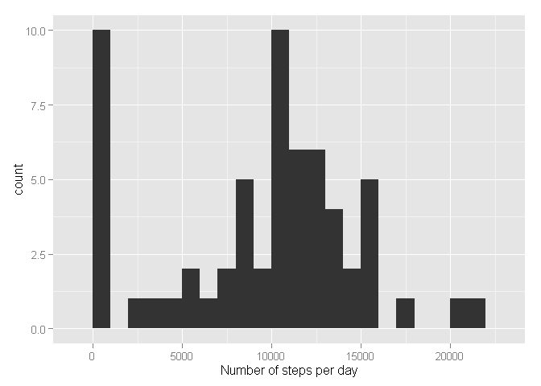
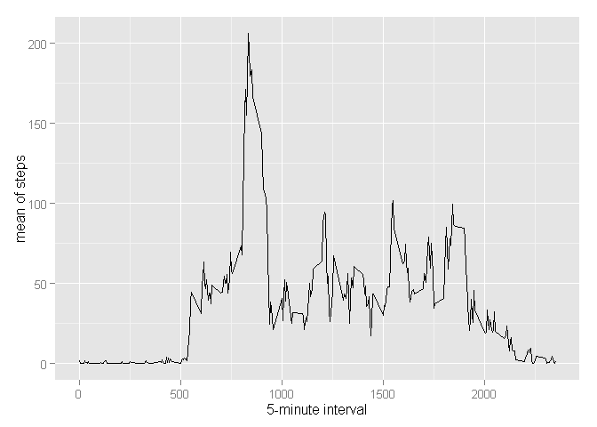
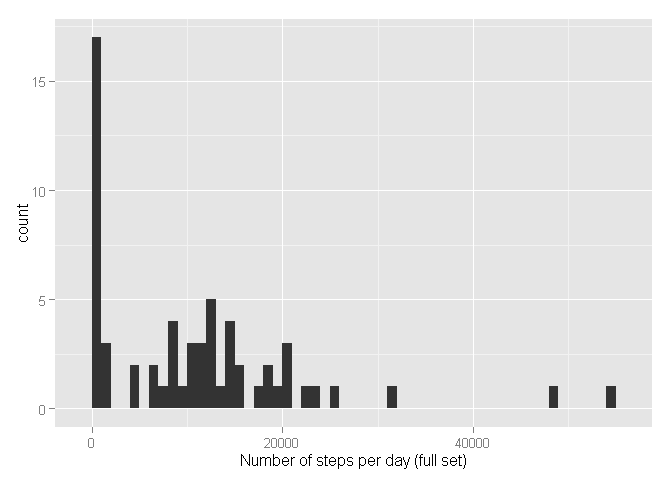
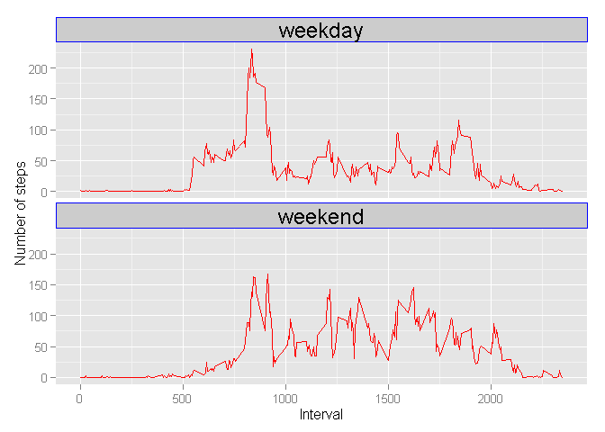

# Reproducible Research: Peer Assessment 1
Efremov Victor  
May 07 2015  

##Introduction
This assignment makes use of data from a personal activity monitoring device. 
This device collects data at 5 minute intervals through out the day. The data 
consists of two months of data from an anonymous individual collected during the 
months of October and November, 2012 and include the number of steps taken in 5 
minute intervals each day.

##Data

The data for this assignment can be downloaded from the course web site:

- Dataset: [Activity monitoring data](https://d396qusza40orc.cloudfront.net/repdata%2Fdata%2Factivity.zip) [52K]

The variables included in this dataset are:

- **steps**: Number of steps taking in a 5-minute interval (missing values are coded as NA)

- **date**: The date on which the measurement was taken in YYYY-MM-DD format

- **interval**: Identifier for the 5-minute interval in which measurement was taken

The dataset is stored in a comma-separated-value (CSV) file and there are a total 
of 17,568 observations in this dataset.


## Loading and preprocessing the data


```r
basedir <- file.path(getwd(),"Data","RepDataAssessment")
D <- read.csv( file = file.path(basedir,"activity.csv") )
summary(D)
```

```
##      steps                date          interval     
##  Min.   :  0.00   2012-10-01:  288   Min.   :   0.0  
##  1st Qu.:  0.00   2012-10-02:  288   1st Qu.: 588.8  
##  Median :  0.00   2012-10-03:  288   Median :1177.5  
##  Mean   : 37.38   2012-10-04:  288   Mean   :1177.5  
##  3rd Qu.: 12.00   2012-10-05:  288   3rd Qu.:1766.2  
##  Max.   :806.00   2012-10-06:  288   Max.   :2355.0  
##  NA's   :2304     (Other)   :15840
```

## What is mean total number of steps taken per day?

Calculate the mean number of steps per day:


```r
steps_per_day <- tapply(D$steps, D$date, FUN=sum, na.rm=TRUE)
```

Look at the mean and median:

```r
mean(steps_per_day, na.rm=TRUE)
```

```
## [1] 9354.23
```

```r
median(steps_per_day, na.rm=TRUE)
```

```
## [1] 10395
```

*I think, mean and median are particularly differ, so distribution is not good shaped*

Look at the distribution of total number of steps per day on the histogram:

```r
library(ggplot2)
```

```
## Warning: package 'ggplot2' was built under R version 3.1.3
```

```r
qplot(steps_per_day, xlab='Number of steps per day' ,binwidth = 1000)
```

 
*I think, distribution is not good shaped because a missing values*


## What is the average daily activity pattern?


```r
mean_per_interval <- aggregate(data = D, steps ~ interval, FUN=mean, na.rm=TRUE )
colnames(mean_per_interval)[2] <- "mean.steps"
```

Draw a daily activity plot:

```r
ggplot(data=mean_per_interval, aes(x=interval, y=mean.steps)) +
  geom_line() +
  xlab("5-minute interval") +
  ylab("mean of steps")
```

 

There is clerly visible maximum on the plot. Let's calculate it:


```r
max_interval <- mean_per_interval[which.max(mean_per_interval$mean.steps),1]
max_time <- format(max_interval/100, 2, format='f')
max_time <- gsub("\\.", ":", max_time)
print(max_time)
```

```
## [1] "8:35"
```
Maximum is at `8:35` AM

## Imputing missing values

But we have some missing values in our set:


```r
NAnum <- sum(is.na(D$steps))
print(NAnum)
```

```
## [1] 2304
```
There are `2304` NA values in our dataset.


Let's create new corrected dataset `D2` that is equal to the original dataset but with the missing data filled in. 
missing values are filling by mean_per_interval values.


```r
# merge
D2 <- merge(D, mean_per_interval, by = "interval", sort= FALSE)

# and replace NA values
D2$steps[is.na(D2$steps)] <- D2$mean.steps[is.na(D2$steps)]
```

Make a histogram of the total number of steps taken each day and calculate and report
the mean and median total number of steps taken per day.


```r
steps_per_day_full <- tapply(D2$steps, D$date, FUN=sum, na.rm=TRUE)
mean(steps_per_day_full, na.rm=TRUE)
```

```
## [1] 10766.19
```

```r
median(steps_per_day_full, na.rm=TRUE)
```

```
## [1] 10351.62
```
Mean and median are more similar than on the first plot. 

Make a plot:

```r
qplot(steps_per_day_full, xlab='Number of steps per day (full set)' ,binwidth = 1000)
```

 

## Are there differences in activity patterns between weekdays and weekends?

Create a new factor variable in the dataset with two levels – "weekday" and "weekend" 
indicating whether a given date is a weekday or weekend day.


```r
# Change locale into english, it need because 
# in different locales there are different first week day
Sys.setlocale("LC_TIME","English United States")
```

```
## [1] "English_United States.1252"
```

```r
# Calculate number of week day (SUNDAY is 0 in this locale)
dates <- strptime(D2$date, "%Y-%m-%d")
D2$weekday <- dates$wday

# Add is.weekend into our set
D2$is.weekend <- "weekday" # by default
D2$is.weekend[ D2$weekday==0 | D2$weekday==6 ]  <- "weekend" 
```

Make panel plot containing a time series plot of the 5-minute interval and the 
average number of steps taken, averaged across all weekday days or weekend days.


```r
mean_per_weekdays <- aggregate(steps ~ interval + is.weekend, data=D2, mean)

ggplot(mean_per_weekdays, aes(interval, steps, colour=is.weekend)) +
  geom_line(color="red")  + 
  facet_wrap(~is.weekend, ncol = 1) +
  theme(legend.position = 'none') + 
  theme(strip.background = element_rect(colour = "blue" ) )+ 
  theme(strip.text = element_text(size = rel(1.5))   )+ 
  xlab("Interval") +
  ylab("Number of steps") 
```

 

*The graph shows that there is a significant difference in the activity before 8 
o'clock in the morning. This is probably due to the fact that on the weekend it's lazy 
to get up early in the morning for physical activity.*


